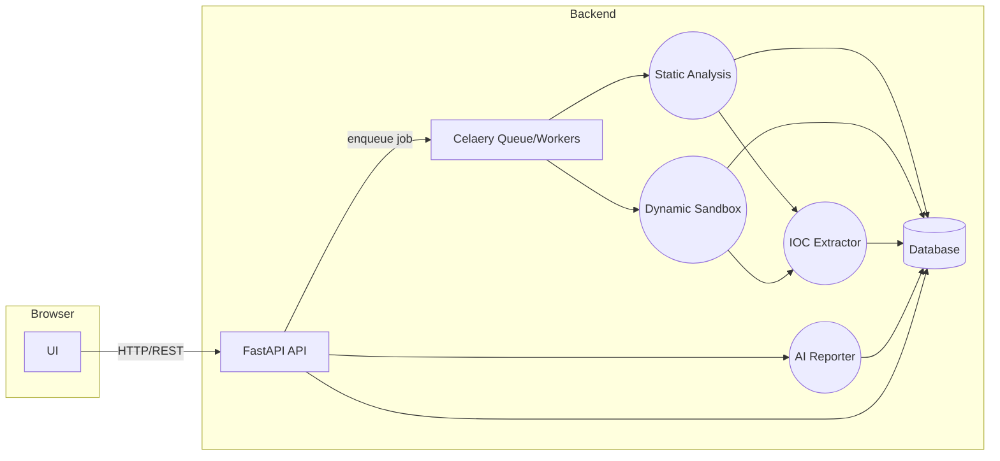

# MalLens: Malware Behavior Analyzer


## Table of Contents
- [Executive Summary](#executive-summary)
- [Project Goal & Scope](#project-goal--scope)
- [Ethical & Legal Safeguards](#ethical--legal-safeguards)
- [Threat Model & Security Controls](#threat-model--security-controls)
- [System Architecture](#system-architecture)
- [Component Responsibilities](#component-responsibilities)
- [Data Models & Storage](#data-models--storage)
- [API Endpoints](#api-endpoints)
- [Frontend User Flows & Wireframes](#frontend-user-flows--wireframes)
- [Tech Stack & Key Libraries](#tech-stack--key-libraries)
- [Deployment & Isolation Strategy](#deployment--isolation-strategy)
- [Testing & CI/CD](#testing--cicd)
- [Privacy & Logging Policy](#privacy--logging-policy)
- [Getting Started](#getting-started)
- [Usage Guide](#usage-guide)
- [Contribution Guidelines](#contribution-guidelines)
- [License](#license)
- [Disclaimer](#disclaimer)

## Executive Summary

MalLens is a **malware behavior analyzer** designed as a defensive security tool to automatically inspect suspicious files and reveal their malicious behavior without compromising production systems. This web-based platform allows users to upload files for both static and dynamic examination, extracts Indicators of Compromise (IOCs), and generates detailed reports. The system operates under a strictly defensive scope, analyzing user-provided samples within a **controlled sandbox** (e.g., isolated VM or container) and never automating any offensive actions. Supported file types include common executable and document formats such as Windows PE, Linux ELF, PDFs, Office documents, and various scripts. Dynamic execution is time- and resource-limited to prevent runaway processes.

Key features encompass **static analysis** (hashes, strings, imports, YARA scanning), **dynamic sandboxing** (VM trace of processes, files, registry, network activity), **IOC extraction** (domains, IPs, hashes, mutexes), and **report generation** (JSON/HTML/PDF, with optional AI-powered summaries). Integration with threat intelligence sources like VirusTotal, AbuseIPDB, and AlienVault OTX enriches the analysis results. All analysis occurs within an **isolated environment**, ensuring user submissions never execute on the host and network access is tightly controlled or disabled. Ethical safeguards, including explicit disclaimers for authorized security research only, strict isolation using VM snapshots, non-persistent disks, and secure sample handling, are enforced throughout the system.

## Project Goal & Scope

**Goal:** To build a full-stack malware analysis platform (demo-ready on GitHub) that helps defenders **understand malware behavior**. The system aims to automatically produce actionable intelligence, including process traces, IOCs, and behavior descriptions, from untrusted files.

**Defensive-Only:** MalLens explicitly disallows any offensive actions. It will not generate or deploy malicious payloads; its sole purpose is to *observe* and report. A clear disclaimer within this README and the UI will state permitted uses (security research, incident response) and prohibit illegal activities.

**Allowed File Types:** The platform supports common malware carriers and related content, including Windows PE/EXE, Linux ELF, Mach-O binaries, common scripts (JS, PowerShell), Office/PDF documents, and archives. File-type validation will reject or quarantine unsupported types (e.g., images, videos) to mitigate risks.

**Limits on Dynamic Execution:** To prevent misuse or resource exhaustion, dynamic runs have strict caps. Each sample executes in a fresh VM or sandbox with a CPU/time limit (e.g., 2–5 minutes runtime). If the timeout is reached, execution is halted. Resource limits (e.g., 1–2 CPU cores, fixed RAM) and disk quotas are applied to avoid Denial-of-Service. Network access is either fully disabled or carefully simulated.

In summary, MalLens is a **self-contained analysis system**. Users upload a file into an *Analysis Queue*; static and dynamic modules process it; IOCs are extracted; and a report is generated. No external execution of the file is permitted, and ethical/legal guidelines (disclaimers, consent) are enforced throughout.

## Ethical & Legal Safeguards

Building a malware analysis tool necessitates careful consideration of safety and legal implications. MalLens incorporates **ethical safeguards** at every stage:

-   **Isolation:** All execution occurs in sandboxed environments, specifically isolated VMs or containers with no sensitive data. The host and analysis environments are disconnected from production networks. Shared folders are disabled, and snapshots are reset after each run to prevent persistent infection.
-   **Sample Handling:** Uploaded files are treated as potentially dangerous. They are hashed immediately, stored in a locked area, and only accessed by the analysis engine. A strict chain-of-custody practice is followed: files are labeled by job ID, the original copy is preserved (for audit) but not executed on the host, and intermediate artifacts are separated. The system does *not* forward raw binaries to any third-party service, only hashes or extracts via API queries (e.g., VirusTotal).
-   **User Consent & Terms of Service:** Before using the tool, users must agree to terms (e.g., in the UI or README) stating they have the right to submit the file and will use results lawfully. Any violation (e.g., obvious copyrighted material or illegal content) triggers a policy to drop the file and potentially report it, per legal requirements.
-   **Logging & Privacy:** The platform logs analysis activities for debugging and audit (e.g., timestamps, IP if multi-user, job metadata). **No user-sensitive data** is stored. Uploaded files and raw malware artifacts are **not** retained long-term (deleted after report generation or a configurable retention period) to protect privacy and comply with regulations. Only derived data (IOCs, summaries) are kept.
-   **Takedown Policy:** A policy is in place to respond to takedown or legal requests for incidentally handled illegal content. MalLens will not host or distribute malware, and the GitHub repository will not contain actual samples. If an uploaded file is flagged as known illegal material, it will be discarded and the user notified.

## Threat Model & Security Controls

MalLens assumes that malicious files or adversaries may target the system. The **threat model** addresses the following risks:

-   **Malware Escape:** The primary risk is sandbox breakout. Malware may attempt to exploit the VM/container or underlying hypervisor. This is mitigated by using up-to-date virtualization (e.g., VirtualBox, KVM with guest tools) and running each analysis in a fresh, unprivileged environment. Potentially dangerous features (e.g., shared clipboard, USB, unrestricted network) are disabled. Hardened runtimes or container technologies (gVisor, Firecracker) that limit syscalls may be explored.
-   **Data Exfiltration / Network Threats:** Malware often attempts to 
call home. MalLens will **strictly control network access**. Options include no external Internet (VM has no NIC or an isolated private network) or allowing connections only to a safe stub. Tools like FakeNet-NG can simulate Internet services locally, capturing DNS/HTTP but blocking actual egress. Firewall rules (e.g., iptables) will enforce egress controls.
-   **Denial of Service:** An attacker might submit extremely large or numerous files to exhaust resources. Mitigation strategies include enforcing a maximum file size (e.g., 100 MB), throttling job submissions per user/IP, and running workers with CPU/memory limits (using cgroups or Kubernetes quotas). The analysis queue limits concurrent jobs and can implement back-pressure for API calls.
-   **Injection & XSS:** The web UI/API will validate all inputs. Uploaded files are treated as binary blobs handled only by analysis code, not rendered in the browser. Any textual output will be sanitized. API endpoints will use parameterized queries (via ORM) to prevent SQL injection.
-   **Data Confidentiality:** Access controls (authentication/authorization) will restrict who can view which reports if multi-user support is implemented. Stored data (reports, IOCs) will be encrypted at rest if regulatory concerns apply.
-   **Dependency Vulnerabilities:** Static/dynamic analysis tools themselves could have bugs. MalLens will pin known-good versions of libraries (e.g., `pefile`, `yara-python`) and run frequent security scans (e.g., OWASP dependency-check in CI).

Following sandboxing best practices is crucial. MalLens adopts controls such as process isolation, minimal privileges, and strict policies (timeouts, syscall whitelists) to ensure that even if malware exploits a vulnerability, it cannot break out beyond the VM.

## System Architecture

A **microservices-style architecture** is proposed for MalLens. The user's browser (Web Frontend) communicates via HTTP to a **FastAPI backend**, which orchestrates the analysis process. A central **Job Queue** (e.g., Redis/Celery) feeds workers that perform the actual analysis. The static analysis engine (Python-based) and the dynamic analysis engine (sandbox) run as separate workers. Results are stored in a **Database** (PostgreSQL) and processed by an **IOC Extractor** component. Finally, an AI Report Generator (optionally using an LLM) summarizes the findings.



This design ensures separation of concerns, scalability, and security. No unsafe code runs in the API or UI layers, and each analysis is isolated in its own process/VM.

## Component Responsibilities

-   **Frontend (Web UI):** A React/Next.js application providing a user dashboard with pages for *Upload*, *Queue Status*, *Analysis Report*, and *Dashboard*. It handles file uploads, displays job progress, and presents detailed analysis results. The UI communicates with the backend via REST API and updates dynamically.
-   **API Server:** A FastAPI application exposing RESTful endpoints for file upload, status checks, and report retrieval. It performs input validation, enqueues jobs, and queries the database for results.
-   **Static Analysis Engine:** A Python worker that computes file hashes (MD5, SHA256), analyzes file format (using `pefile` for PE, or similar libraries for ELF/Mach-O), extracts strings, performs YARA signature matching, and calculates entropy. It stores findings in the database and flags high-risk indicators.
-   **Dynamic Sandbox Engine:** An isolated virtual machine (or container) that executes the sample. This component would typically integrate with an existing sandbox like **Cuckoo Sandbox**. It automates VM snapshot reversion, sample transfer, execution, and monitors system behavior (processes, file/registry modifications, network traffic, memory dumps). Logs and artifacts are collected and stored in the database.
-   **IOC Extractor:** A Python component that parses static and dynamic outputs to harvest IOCs (URLs/domains, IPs, file hashes, mutex names, registry keys, email addresses). It de-duplicates, categorizes, and stores them, optionally enriching them with external Threat Intelligence APIs (e.g., VirusTotal, AbuseIPDB, AlienVault OTX).
-   **AI Report Generator:** (Optional advanced feature) A service that takes collected data and produces a written summary. A transformer-based model (e.g., GPT) can generate an 
“Executive Summary” of the malware’s behavior, querying the database, forming a prompt, and generating human-readable paragraphs.
-   **Database:** A PostgreSQL database for reliable relational storage of job records, static analysis results, dynamic logs (as JSON blobs or tables), IOCs, and generated reports. It enables querying and joining data for dashboards and API responses.
-   **Queue / Worker Infrastructure:** A job queue (e.g., Celery with Redis/RabbitMQ) manages asynchronous tasks. It decouples the API from analysis, allowing for horizontal scaling of static and dynamic analysis workers.

## Data Models & Storage

A relational schema (PostgreSQL) is used with tables for core entities. Key tables include:

| Table            | Fields                                                                                                                              | Description                                                                 |
| :--------------- | :---------------------------------------------------------------------------------------------------------------------------------- | :-------------------------------------------------------------------------- |
| `analyses`       | `id` (PK), `user_id` (FK), `file_name`, `file_hash`, `file_size`, `created_at`, `completed_at`, `status` (enum), `threat_level`, `threat_score` | Tracks file metadata and processing state for each uploaded sample.         |
| `static_results` | `analysis_id` (FK), `hash_md5`, `hash_sha1`, `hash_sha256`, `file_type`, `entropy`, `imports` (JSON), `strings` (JSON), `yara_matches` | Stores results from static analysis.                                        |
| `dynamic_results`| `analysis_id` (FK), `process_logs` (JSON), `file_changes` (JSON), `registry_changes` (JSON), `network_log` (JSON)                     | Raw dynamic behaviors captured by the sandbox.                              |
| `iocs`           | `id`, `analysis_id` (FK), `ioc_type` (IP, domain, URL, hash, mutex), `value`, `context`, `severity`, `confidence`, `ti_source`        | Extracted Indicators of Compromise, with optional TI enrichment.            |
| `reports`        | `id`, `analysis_id` (FK), `executive_summary` (Text), `detailed_analysis` (Text), `recommendations` (Text), `risk_assessment` (Text), `mitre_mapping` (JSON), `generated_at`, `generator` | Generated human-readable analysis reports.                                  |
| `users`          | `id`, `username`, `email`, `password_hash`, `created_at` (Optional)                                                                 | Registered user accounts (if multi-user support is implemented).            |

Raw binary content (original file, memory dumps, PCAP) is not stored in the database but kept on disk, with the DB referencing file paths if needed.

## API Endpoints

A RESTful API (FastAPI) facilitates interactions with the frontend. Example endpoints:

-   `POST /api/upload`: Upload a file for analysis. Accepts `multipart/form-data`. Returns a `job ID` (`analysis_id`).
-   `GET /api/status/{analysis_id}`: Check the status of an analysis job. Returns JSON with `status` and timestamps.
-   `GET /api/report/{analysis_id}`: Retrieve the full analysis report, including static metadata, dynamic findings, IOC list, and summary text.
-   `GET /api/queue`: List recent analysis jobs (if authenticated, shows user’s jobs).
-   `GET /api/dashboard`: Provides aggregated statistics (total analyses, high-risk samples, top IOCs) for UI display.
-   `DELETE /api/analysis/{analysis_id}`: Deletes an analysis and its associated data.

All API calls will require authentication (token or session) if multi-user support is enabled. Responses use JSON schema, and error responses include codes and messages. API documentation will be auto-generated by FastAPI (e.g., via `/docs`).

## Frontend User Flows & Wireframes

The user interface will feature several key screens:

-   **Upload Page:** A primary screen with a drag-and-drop or click-to-select upload box for suspicious files. Upon submission, the UI displays the filename and an 
"Analyze" button. A spinning icon indicates processing, and the new job appears in the Queue.
-   **Queue / Job List:** This page lists recent analysis jobs, showing file name, submission time, and current status (e.g., “Pending,” “Analyzing (23%),” or “Complete”). Progress bars or spinners indicate activity. Users can cancel or delete jobs.
-   **Analysis Report Page:** Once analysis is complete, users can view detailed reports. This page will present tabs or sections for:
    -   **Summary:** A high-level, possibly AI-generated, summary of the sample’s behavior.
    -   **Static Analysis:** A table of hashes, file type, detected packer/entropy, imported DLLs/APIs, and YARA hits.
    -   **Behavior Timeline:** A chronological log of observed events (e.g., process starts, file creations, registry modifications).
    -   **Network & IOCs:** A list of network connections, domains contacted, and extracted IOCs, categorized by type.
    -   **Full Logs:** Raw detailed logs (e.g., procmon output, PCAP dump links) if needed.
    Buttons will be available to export (JSON, CSV, STIX) or download the full report (HTML/PDF).
-   **Dashboard / Stats Page:** An overview screen displaying aggregate metrics such as total samples analyzed, high-risk counts, top malware families or IOC statistics, and a chart of analyses over time.

The UI design will follow modern dashboard templates (Next.js + Tailwind CSS) to ensure responsiveness and an intuitive user experience.

## Tech Stack & Key Libraries

MalLens leverages a robust and modern tech stack:

| Component            | Example/Library               | Rationale                                             |
| :------------------- | :---------------------------- | :---------------------------------------------------- |
| Web Framework        | FastAPI                       | High performance, async support, automatic OpenAPI documentation. |
| Frontend UI          | React / Next.js, Tailwind CSS | Modern, responsive, interactive UI with ready-made components. |
| Static Analysis      | `pefile`, `yara-python`       | Well-known, open-source tools for malware analysis.   |
| Dynamic Sandbox      | Cuckoo Sandbox (integration)  | Established VM-based malware analysis framework.      |
| TI Integration       | VirusTotal API v3, AbuseIPDB, OTX | Access to external threat intelligence data.          |
| Database             | PostgreSQL                    | Reliable relational storage, supports JSON data types. |
| Queue/Workers        | Celery + Redis                | Scalable asynchronous task processing.                |
| Containerization     | Docker, Docker Compose        | For reproducible development and deployment environments. |
| CI/CD                | GitHub Actions, Pytest        | Automated testing and continuous integration.         |

## Deployment & Isolation Strategy

To safely execute untrusted code, MalLens employs a strong isolation strategy:

-   **VM vs. Container:** Full VMs (VirtualBox, KVM/QEMU) are preferred for Windows malware analysis due to their stronger isolation properties compared to containers, which share the host kernel. MalLens will follow Cuckoo Sandbox’s model: one or more Windows/Linux guest VMs (with a Cuckoo agent) on a host. Each job boots a clean snapshot in headless mode. Containers (Docker) are used for *components* (API, workers) but not for actual sample execution.
-   **Network Control:** Guest VMs will have **no external Internet access** by default. They will be attached to a host-only network or an internal NAT with no gateway. DNS/HTTP requests by malware can be intercepted by a local proxy (e.g., FakeNet-NG). External queries (e.g., to TI APIs) will go through the API server, not directly from the VM.
-   **Snapshot/Rollback:** Each VM will be non-persistent. After analysis (normal finish or timeout), the VM is restored to a clean snapshot to prevent residue. Snapshots are prepared offline beforehand. Non-persistent disks (ephemeral) add an extra layer of safety.
-   **Resource Limits:** CPU and RAM for each VM will be limited (e.g., 1–2 CPUs, 2–4 GB RAM per analysis). Analysis runtime will also be capped (e.g., 5 minutes) to prevent resource exhaustion.
-   **Firewall/Egress:** The host system will have a firewall to prevent VM escapes. Guest VMs may run on isolated VLANs or bridges to a logging network. All external traffic from VMs will be blocked or logged.
-   **Secrets & Credentials:** Analysis VMs will use “fake” credentials. Real passwords or tokens will never be stored in guests.

`docker-compose.yml` will define the API, frontend, database, and queue services. The sandbox VMs can be managed separately or integrated via Docker if suitable images are available. The priority is **isolation**.

## Testing & CI/CD

A robust testing strategy ensures reliability and security:

-   **Unit Tests:** Each module (static analysis, IOC extractor, API routes) will have unit tests using `pytest`. FastAPI’s `TestClient` will be used for API testing.
-   **Integration Tests:** A CI job will spin up the Docker stack and run a full analysis on a test sample (e.g., EICAR). This verifies the entire pipeline: upload -> queue -> report returned.
-   **Security Tests:** Tests for malicious inputs (e.g., SQL injection, corrupted file formats) will ensure graceful handling. Automated dependency scanning (e.g., `pip-audit`, GitHub Dependabot) will be used.
-   **Continuous Integration:** GitHub Actions will run tests on every pull request/commit, build Docker images, and push them to a registry. Linting (flake8, mypy) will enforce code quality.
-   **Safe Dynamic Test Harness:** For dynamic analysis, carefully curated benign samples or network-sandboxed modes (FakeNet) will be used in CI to avoid running dangerous code.

## Privacy & Logging Policy

-   **Data Privacy:** MalLens does not collect personal user data beyond optional accounts (if implemented, only name/email). Uploaded files are not considered PII. User IP addresses or usage logs are not stored in the final product, except transiently for security audits. Logs are rotated/purged.
-   **Logging:** Application logs will not contain sensitive content. Database audit trails may record who accessed which reports (if user accounts exist). Logs will be protected.
-   **Retention:** Analysis data (files, logs) is considered confidential. A retention policy (e.g., delete raw results after 30 days) will be configured. IOCs and sanitized results can remain. Users will have the ability to delete their own analysis data.
-   **Privacy Notices:** The GitHub README will detail data collection and retention. MalLens will comply with privacy laws (e.g., GDPR) by allowing data deletion requests.

## Getting Started

To set up and run MalLens locally, follow these steps:

### Prerequisites

-   [Docker](https://www.docker.com/get-started) (Docker Engine and Docker Compose)
-   [Git](https://git-scm.com/book/en/v2/Getting-Started-Installing-Git)

### Installation

1.  **Clone the repository:**
    ```bash
    git clone https://github.com/gozar/MalLens.git
    cd MalLens
    ```

2.  **Set up environment variables:**
    Copy the example environment file for the backend:
    ```bash
    cp backend/.env.example backend/.env
    ```
    Edit `backend/.env` to configure your settings. At a minimum, you should set `SECRET_KEY`. Optionally, add API keys for VirusTotal, AbuseIPDB, OTX, and OpenAI for enhanced analysis and AI-generated reports.

3.  **Build and run with Docker Compose:**
    ```bash
    docker-compose up --build
    ```
    This command will:
    -   Build the `db` (PostgreSQL), `redis`, `api` (FastAPI), and `frontend` (React/Nginx) services.
    -   Start all services in detached mode.
    -   Create necessary Docker volumes.

4.  **Access the application:**
    Once all services are up and running, you can access the MalLens web interface at `http://localhost:3000`.

## Usage Guide

1.  **Upload a Sample:** Navigate to the "Upload Sample" page. Drag and drop your suspicious file or click to select it. Click "Analyze Sample" to begin the analysis.
2.  **Monitor Analysis Queue:** The "Analysis Queue" page displays all submitted jobs, their current status (pending, processing, completed, error), and threat levels. You can refresh the queue to see updates.
3.  **View Report:** Once an analysis is completed, click "View Report" from the queue or navigate directly to `/report/{analysis_id}`. The report provides:
    -   **Executive Summary:** An AI-generated overview of the malware's behavior.
    -   **Static Analysis:** Details like file hashes, type, entropy, suspicious imports, and YARA matches.
    -   **Behavioral:** A timeline of observed actions, process tree, and system modifications.
    -   **IOCs & Network:** Extracted Indicators of Compromise and network activity logs.
4.  **Dashboard:** The "Dashboard" provides an overview of all analyses, threat distribution, and recent activity.

## Contribution Guidelines

We welcome contributions to MalLens! Please follow these guidelines:

-   **Fork the repository** and create a new branch for your feature or bug fix.
-   **Follow existing code style** and conventions.
-   **Write unit and integration tests** for your changes.
-   **Ensure all tests pass** before submitting a pull request.
-   **Provide clear and concise commit messages**.

## License

This project is licensed under the MIT License - see the [LICENSE](LICENSE) file for details.

## Disclaimer

MalLens is provided "as is," without warranty of any kind, express or implied, including but not limited to the warranties of merchantability, fitness for a particular purpose, and noninfringement. In no event shall the authors or copyright holders be liable for any claim, damages, or other liability, whether in an action of contract, tort, or otherwise, arising from, out of, or in connection with the software or the use or other dealings in the software.

**This tool is intended for authorized security research and incident response purposes only. The user is solely responsible for ensuring they have the legal right to analyze any submitted files. Misuse for offensive or illegal activities is strictly prohibited.**

## References

[1] Cuckoo Sandbox Documentation: <https://cuckoosandbox.org/>
[2] FastAPI Documentation: <https://fastapi.tiangolo.com/>
[3] YARA Documentation: <https://virustotal.github.io/yara/>
[4] pefile (Python PE parsing library): <https://github.com/erocarrera/pefile>
[5] MITRE ATT&CK Framework: <https://attack.mitre.org/>
[6] FakeNet-NG (Network simulation tool): <https://github.com/mandiant/FakeNet-NG>
[7] VirusTotal API: <https://developers.virustotal.com/v3.0/reference>
[8] AbuseIPDB API: <https://www.abuseipdb.com/api.html>
[9] AlienVault OTX API: <https://otx.alienvault.com/api>
[10] OpenAI API: <https://platform.openai.com/docs/api-reference>
